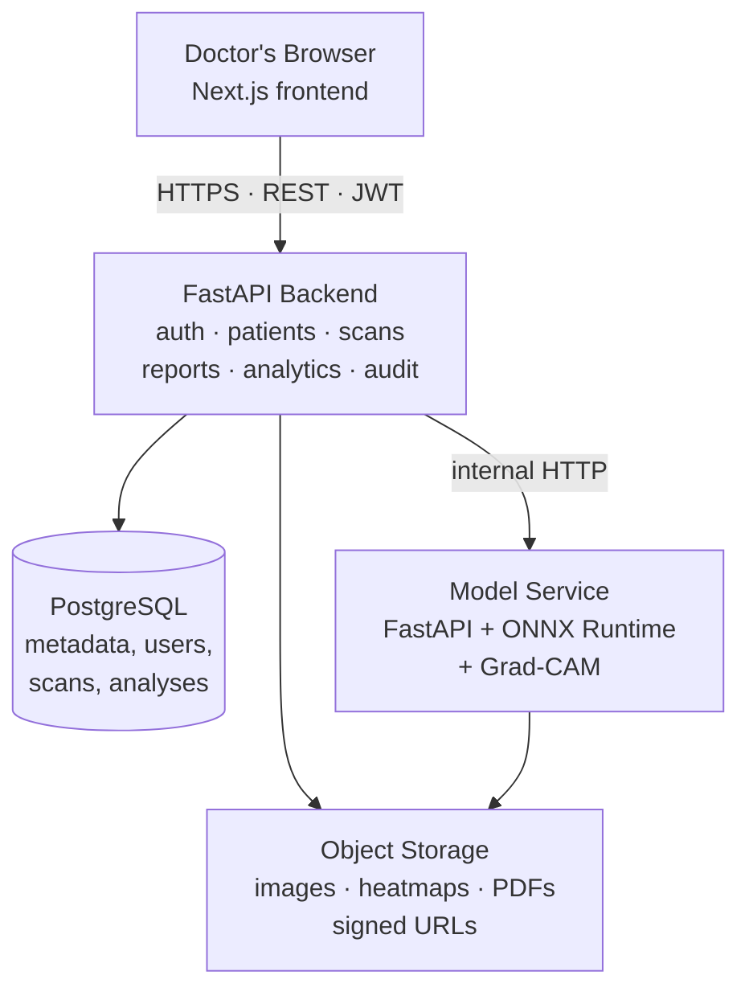
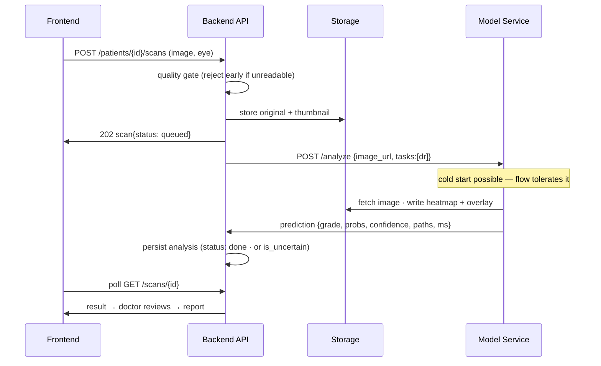
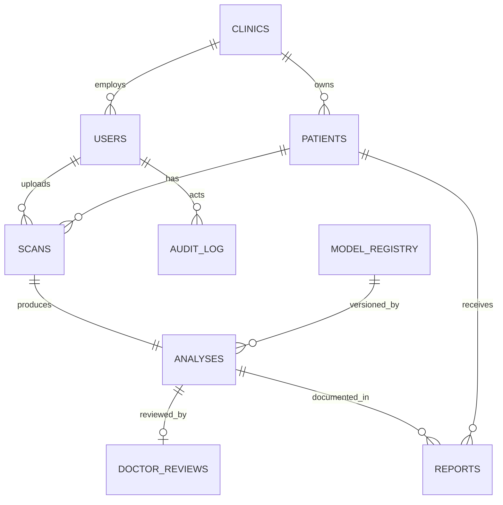
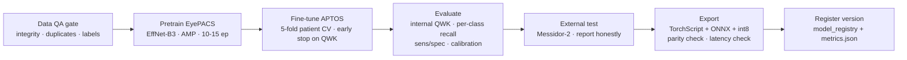
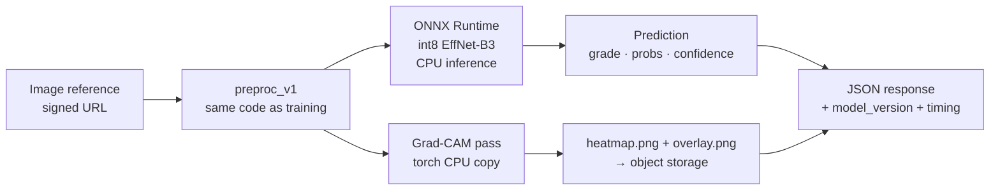
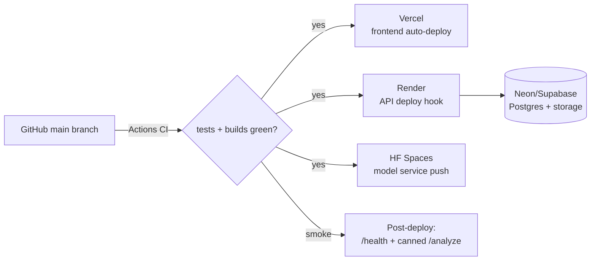
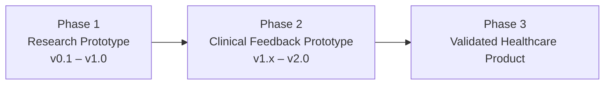

# VisionCare AI — Complete Software & Product Specification Document

**Intelligent Retinal Disease Screening Assistant**

| | |
|---|---|
| **Document version** | 2.1 (supersedes SRS v1.2 and the separate-documents plan) |
| **Date** | September 2026 |
| **Author** | Mehran Uddin |
| **Scope** | SRS + Technical Design + AI Development Plan + Deployment + Testing — the single authoritative blueprint |
| **Repository location** | `docs/SPECIFICATION.md` |

> **v2.1 change note:** twelve execution-strategy sections added (13A, 14A–14D, 17A, 20A–20B, 21A–21C, 23A). Lettered numbering preserves all existing section numbers and cross-references.

> **Documentation model:** this project maintains ONE specification document (this file). Section-specific detail that outgrows this document (e.g., pixel-level UI specs) is added as an appendix, not a sibling document. Rule: if reality disagrees with this document, amend the document in the same PR that changes the code.

---

# 1. Executive Summary

**Product name:** VisionCare AI

**Description:** VisionCare AI is an AI-assisted retinal screening system. A doctor uploads a retinal fundus photograph; a deep-learning model grades diabetic retinopathy severity on the standard 5-class scale, shows *why* via a Grad-CAM heatmap, and produces a professional PDF screening report — with the doctor's confirmation or override recorded on every result.

**Vision:** multiply the reach of scarce ophthalmologists by putting a reliable, explainable screening layer in front of them — starting with diabetic retinopathy, the most screenable cause of preventable blindness.

**Main goal (v1.0):** a deployed, demo-able, honest MVP: one disease done properly, end-to-end — reproducible training → evaluated model → explainable inference → doctor-reviewed report — built by one developer at $0/month.

**Target users:** doctors and medical officers running diabetic-patient screening (clinics, screening camps); clinic administrators; and — via Demo Mode — portfolio reviewers, recruiters, and potential partners.

**Medical safety positioning (governs every design decision in this document):**

> **VisionCare AI is an AI-assisted retinal screening system and not a replacement for medical diagnosis.** Every output is a screening suggestion requiring review by a qualified clinician. The system never diagnoses, keeps a human in the loop on every result, and enforces safe language rules (§7, FR-9) at CI level.

---

# 2. Problem Statement

**The healthcare problem.** Diabetic retinopathy (DR) affects roughly one in three people with diabetes and is a leading cause of preventable blindness. Early stages are symptomless; by the time vision degrades, damage is often irreversible. Detected early, progression can be halted with treatment.

**Current challenges.**
- Screening requires a trained reader for every fundus image; ophthalmologist density in rural South Asia and similar regions is far below need (often < 1 per 100,000 people).
- Fundus cameras are increasingly cheap and portable — the bottleneck has shifted from *capturing* images to *reading* them.
- Manual grading is slow, variably consistent between readers, and produces inconsistent documentation.
- Screening camps generate hundreds of images per day with no triage mechanism; high-risk patients wait in the same queue as healthy ones.

**Why AI assistance is valuable.** DR grading from fundus images is one of the most validated tasks in medical imaging AI (multiple regulator-cleared products exist globally). An assistant that pre-grades images lets one specialist supervise the volume of many, prioritizes referable cases, and generates consistent reports — without removing the clinician from any decision.

**Target market problem (initial wedge).** Small clinics and screening programs in Pakistan and comparable markets cannot afford enterprise screening systems and lack the specialist time to read every image. A low-cost, browser-based assistant with honest positioning fits where enterprise products don't reach.

---

# 3. Product Objectives

## 3.1 Business objectives

| ID | Objective | Measure |
|---|---|---|
| BO-1 | Improve screening efficiency | A doctor processes a patient (upload → reviewed result → report) in under 3 minutes |
| BO-2 | Assist, never replace, doctors | 100% of results carry doctor confirmation/override before a report exists |
| BO-3 | Reduce manual documentation workload | Report generation is one click from a reviewed result |
| BO-4 | Build a credible portfolio/startup asset | Public demo mode + published honest metrics + case study |

## 3.2 Technical objectives

| ID | Objective | Measure |
|---|---|---|
| TO-1 | Build a real DR grading model | Internal QWK ≥ 0.80 gate (§14.4 tiered targets) |
| TO-2 | Explainable predictions | Grad-CAM heatmap on every graded result |
| TO-3 | Deploy the complete system | All four components live on free tiers, smoke tests green |
| TO-4 | Reproducibility | Any model version rebuildable from versioned data + config + seed |
| TO-5 | Zero budget | $0/month infrastructure (§23) |

The MVP proves a working, explainable, deployed AI pipeline — **not** clinical certification (see §25 Limitations and §27 Commercialization).

---

# 4. Scope Definition

## 4.1 Version 1.0 MVP — in scope

- **Diabetic Retinopathy screening only** — the single clinical AI capability of v1
- Fundus image upload (JPG/PNG) with automated quality validation
- AI classification: 5-class DR grade + per-class probabilities + confidence
- Grad-CAM explanation overlay on every graded result
- Patient management (profiles, history, scan timeline)
- Doctor review (confirm/override) on every analysis
- PDF screening reports
- Doctor dashboard with statistics and high-risk list
- Demo Mode (seeded demo clinic, live inference, isolated from real data)
- Dockerized: frontend, backend API, AI service, database
- Deployed on free tiers with CI/CD

**Rationale for single-disease scope:** one disease done properly — data QA, training, evaluation, explainability, deployment, reporting, safety language — is already a complete AI healthcare product for a solo developer. Additional diseases multiply dataset, evaluation, and safety-testing effort without changing what the project proves.

## 4.2 Future versions — explicitly out of v1

| Feature | Target | Note |
|---|---|---|
| Glaucoma risk detection | v2.0 | Needs REFUGE/ORIGA datasets, disc/cup segmentation, own safety review |
| AMD risk detection | v2.0 | ODIR-trained classifier |
| Mobile applications | v2.x | v1 is responsive web |
| Hospital EMR / HL7 / FHIR integration | v2.x | |
| DICOM ingestion | v2.x | |
| Billing / subscriptions | Commercial phase | Architecture leaves room; nothing built |
| Multi-tenant SaaS platform work | Commercial phase | v1 is multi-clinic by schema, single-operator in practice |

The model-service API, `analyses` schema, and model registry are multi-task-shaped from day one, so v2 diseases are additive — no v1 rework.

## 4.3 Assumptions & constraints

- Solo developer; milestone-based (no calendar commitments).
- Training compute: Kaggle free GPU (30 hrs/week, 12-hr sessions) + Colab overflow.
- Public research datasets only; no patient data collected during development.
- Free hosting: cold starts (~30 s), ~2 GB RAM for inference → ONNX CPU inference required.
- Medical disclaimer on every AI-output surface (Appendix A).

---

# 5. User Roles

| Role | Responsibilities | Permissions | Typical actions |
|---|---|---|---|
| **Doctor** | Clinical use: manage own patients, screen, review AI results, sign reports | Full CRUD on own clinic's patients, scans, analyses, reports | Add patient · upload scan · review/override AI grade · generate report · view timeline |
| **Clinic Admin** | Operate a clinic account | Invite/deactivate doctors; view clinic-wide analytics; no clinical sign-off | Manage staff · monitor volume, grade distribution, high-risk counts |
| **System Administrator** (internal) | Operate the platform | Infrastructure, model registry, audit logs; no routine access to patient PII | Deploy model versions · monitor health · review audit summaries |
| **Demo User** | Evaluate the product (recruiter/investor/reviewer) | Doctor-level permissions **inside the demo clinic only**; rate-limited; nightly reset | Log in with published credentials · browse seeded patients · run live analysis on sample images · download watermarked demo reports |

---

# 6. User Stories

**Doctor**
- As a doctor, I want to upload retinal fundus images for a patient, so that I receive AI-assisted screening results within seconds.
- As a doctor, I want a Grad-CAM heatmap with every prediction, so that I can judge which regions influenced the AI and whether to trust it.
- As a doctor, I want to confirm or override every AI grade, so that the final record always reflects my clinical judgment.
- As a doctor, I want a one-click PDF report containing both the AI finding and my confirmed finding, so that I can hand the patient a professional referral document.
- As a doctor, I want each patient's scan timeline, so that I can track progression across visits.
- As a doctor, I want low-confidence results clearly flagged as "uncertain," so that I never mistake a weak output for a reliable grade.
- As a doctor, I want poor-quality images rejected with a reason, so that I can re-capture instead of trusting a grade from an unreadable image.

**Clinic Admin**
- As a clinic administrator, I want dashboard analytics (scan volume, grade distribution, high-risk counts), so that I can monitor screening activity.
- As a clinic administrator, I want to invite and deactivate doctor accounts, so that access matches current staff.

**System**
- As a system administrator, I want every prediction stamped with model and preprocessing versions, so that any result is traceable to the exact system state that produced it.
- As a system administrator, I want a golden-image regression gate on model releases, so that a new model can never silently degrade production behavior.
- As a system administrator, I want an append-only audit log of clinical actions, so that accountability is provable.

**Demo User**
- As a portfolio reviewer, I want a pre-seeded demo account, so that I can experience the full workflow — including live AI — in under five minutes without entering data.

---

# 7. Functional Requirements

Priorities: **M**ust / **S**hould / **C**ould (MoSCoW). Every requirement has testable acceptance criteria (AC); §22 maps them to tests.

## FR-1 Authentication

| ID | Requirement | Pri | Acceptance criteria |
|---|---|---|---|
| FR-1.1 | Email/password registration with email verification | M | Unverified account cannot log in; verification link expires in 24 h; duplicate email rejected with clear message |
| FR-1.2 | JWT login (access + refresh) | M | Valid credentials → 200 with token pair (access 15 min, refresh 7 d); invalid → 401; account lockout after 5 failed attempts/min |
| FR-1.3 | Password reset via email | S | Reset link single-use, 1 h expiry; old password invalid after reset; all sessions revoked |
| FR-1.4 | Password rules | M | Min 8 chars; stored bcrypt cost 12; plaintext never logged |

## FR-2 Patient Management

| ID | Requirement | Pri | Acceptance criteria |
|---|---|---|---|
| FR-2.1 | Create patient (name, DOB/age, sex, contact, diabetes type & duration, hypertension, notes) | M | Created patient appears in list ≤ 1 s; required fields validated; patient scoped to creating clinic |
| FR-2.2 | Update patient | M | PATCH semantics; changes audit-logged with before/after |
| FR-2.3 | Archive patient (soft delete — never hard delete) | M | Archived patients excluded from default lists but reachable via filter; scans/reports remain intact; no endpoint hard-deletes a patient |
| FR-2.4 | Patient list: search, filter (risk, last-scan date), pagination | M | Search by partial name; list p95 < 500 ms at 1,000 patients |
| FR-2.5 | Patient detail with scan timeline & grade progression | M | Timeline ordered by date; each entry links to its analysis and report |

## FR-3 Image Management

| ID | Requirement | Pri | Acceptance criteria |
|---|---|---|---|
| FR-3.1 | Upload JPG/PNG ≤ 10 MB, eye tagged OD/OS | M | Wrong MIME/magic-bytes rejected 422; > 10 MB rejected 413; success creates scan row status `queued` |
| FR-3.2 | Automated quality gate (blur via Laplacian variance, exposure, field-of-view mask, fundus-vs-non-fundus check) | M | Non-fundus and unreadable images end in status `rejected` with a specific reason string; rejected scans never reach the model |
| FR-3.3 | Secure storage | M | Object storage, randomized keys, private bucket; images served only via short-lived signed URLs; EXIF stripped on re-encode |
| FR-3.4 | Batch both-eyes upload | S | Two images submitted in one flow create two linked scans |

## FR-4 AI Analysis

| ID | Requirement | Pri | Acceptance criteria |
|---|---|---|---|
| FR-4.1 | 5-class DR grading with per-class probabilities and top-class confidence | M | Response contains grade 0–4, 5 probabilities summing to ~1, confidence float; persisted in `analyses` |
| FR-4.2 | Grad-CAM heatmap per graded result | M | `overlay.png` + `heatmap.png` stored and linked; overlay aligned to original image dimensions |
| FR-4.3 | Async flow: `queued → processing → done/failed/rejected` | M | Upload returns immediately; frontend polls status; cold-start of model host does not error the user flow |
| FR-4.4 | Uncertainty handling | M | Top-class probability < 0.60 or marginal quality → `is_uncertain = true`, **no grade displayed**, "manual review required" state |
| FR-4.5 | Traceability | M | Every analysis stores `model_version`, `preproc_version`, `inference_ms` |
| FR-4.6 | Doctor review: agree/override with optional comment | M | Report generation blocked until a review exists; override stores both AI grade and final grade; review audit-logged |
| FR-4.7 | Inference latency | M | ≤ 10 s p95 on free-tier CPU (excluding cold start); target ≤ 3 s with int8 ONNX |

## FR-5 Reports

| ID | Requirement | Pri | Acceptance criteria |
|---|---|---|---|
| FR-5.1 | One-click PDF: clinic header, patient info, image + heatmap thumbnails, AI finding + confidence, doctor's confirmed finding, template recommendation, disclaimer, signature line, report number, timestamp | M | PDF generated ≤ 5 s; immutable once created; report number unique |
| FR-5.2 | Report list & re-download per patient | M | Historical reports always retrievable via signed URL |
| FR-5.3 | Recommendation text from fixed reviewed template table keyed by grade | M | No free-text AI-generated recommendations exist anywhere in a report |

## FR-6 Dashboard

| ID | Requirement | Pri | Acceptance criteria |
|---|---|---|---|
| FR-6.1 | KPI cards: total patients, scans this month, high-risk patients, pending reviews | M | Numbers reconcile with database queries; load < 2 s |
| FR-6.2 | High-risk list (Severe/Proliferative DR) | M | Every listed patient links to the triggering analysis |
| FR-6.3 | Charts: scans over time, grade distribution, AI-vs-doctor agreement rate | S | Agreement rate = agrees / reviews, displayed as trend |

## FR-7 Audit & Safety

| ID | Requirement | Pri | Acceptance criteria |
|---|---|---|---|
| FR-7.1 | Append-only audit log: auth events, patient CRUD, uploads, analyses, reviews, report generation | M | No update/delete path exists for audit rows; each row has actor, action, entity, timestamp |
| FR-7.2 | Disclaimer (Appendix A) on every AI-output surface and every PDF | M | Verified by release checklist + string presence test |

## FR-8 Demo Mode

| ID | Requirement | Pri | Acceptance criteria |
|---|---|---|---|
| FR-8.1 | Demo account with published credentials into a seeded demo clinic | M | Login works from README credentials without any setup |
| FR-8.2 | Seed data: 8–12 fictional patients across all DR grades, 1–3 openly licensed sample images each, completed analyses with heatmaps, 2–3 pre-generated reports | M | A reviewer sees a *lived-in* product on first login |
| FR-8.3 | Live inference available on provided sample images | M | Demo user can run a real analysis end-to-end (AI is live, not mocked) |
| FR-8.4 | Isolation & reset | M | `clinics.is_demo = true`; demo rows excluded from all real analytics; nightly job restores seed state |
| FR-8.5 | "DEMO MODE — fictional data" banner on every screen and watermark on every demo PDF | M | Demo output can never be mistaken for a clinical document |
| FR-8.6 | Demo rate limit (e.g., 20 analyses/day) | S | Protects free-tier compute |

## FR-9 Medical-Safe Language (testable wording rules)

The system never presents itself as diagnosing. Applies to every UI string, report sentence, notification, and API message; enforced by an automated string-lint CI test plus manual release review.

| ID | Requirement | Pri | Acceptance criteria |
|---|---|---|---|
| FR-9.1 | Prohibited phrasings: "You have [disease]", "Patient has [disease]", "diagnosed with", "diagnosis:", "suffering from" | M | String-lint scan of frontend strings, report templates, API messages passes on every PR |
| FR-9.2 | Required phrasings: "Possible indicators of [condition] detected", "AI screening suggestion", "Findings consistent with [grade] — requires ophthalmologist review" | M | Result screen and PDF use approved phrasings only |
| FR-9.3 | "AI Screening Suggestion — Doctor Review Required" label adjacent to every finding | M | Present on result screen and PDF |
| FR-9.4 | Uncertain state language is neutral: "The AI could not produce a confident assessment for this image" | M | Never implies health or disease |

---

# 8. Non-Functional Requirements

| Category | Requirement |
|---|---|
| **Performance** | Non-AI API endpoints p95 < 500 ms (excluding free-tier cold starts); dashboard < 2 s; AI inference ≤ 10 s CPU (target ≤ 3 s int8 ONNX); PDF ≤ 5 s |
| **Model quality (tiered)** | **MVP gate (blocks release):** internal QWK ≥ 0.80 on APTOS held-out patients; referable-DR (Moderate+) sensitivity ≥ 0.85 @ specificity ≥ 0.75. **MVP reported (honest, not gated):** external Messidor-2 QWK, expected 0.70–0.80, published as-is. **Production target:** external QWK ≥ 0.85, referable sensitivity ≥ 0.90 @ specificity ≥ 0.80, after larger datasets, ensembling, clinical validation. Rationale: the internal gate proves the pipeline; the external number measures real generalization; conflating them produces a fake success or a fake failure. |
| **Availability** | 99% for MVP (free-tier realistic; cold starts documented); design for 99.9% at commercial stage |
| **Scalability** | Stateless API + separate model service → horizontal scaling by adding containers; async job flow absorbs bursts |
| **Security** | TLS everywhere; bcrypt(12); short-lived JWT with refresh rotation; RBAC + clinic scoping enforced centrally; private storage + signed URLs (full design §17) |
| **Privacy** | Data minimization; per-clinic isolation; archive-not-delete for clinical records but hard-delete honored on verified data-subject request; demo data segregated; no patient data used for training without an explicit consent flag |
| **Usability** | Responsive to 360 px; core flow usable on a 6-inch phone; WCAG AA contrast; risk conveyed by color + icon + text, never color alone; low-bandwidth friendly (≤ 100 KB thumbnails, lazy loading) |
| **Maintainability** | TypeScript frontend; Python type hints + Pydantic; ≥ 70% backend core coverage; training reproducible from versioned config + data + seed; Conventional Commits; this document amended with code |
| **Traceability** | Every prediction: model version + preproc version + timestamp; every clinical action audit-logged |
| **Compliance posture** | Not a certified medical device in v1; research/decision-support positioning with human-in-the-loop; audit + consent architecture keeps a future regulatory pathway open (§27) |

---

# 9. Complete System Architecture



**Component responsibilities**

| Component | Owns | Never does |
|---|---|---|
| **Frontend** | UI, auth token handling, upload UX, status polling, result presentation | Business rules; direct DB or model access |
| **Backend API** | Auth, authorization (clinic scoping), patient/scan/report CRUD, orchestration of analysis jobs, PDF generation, analytics, audit | ML inference (delegated); serving raw files (signed URLs instead) |
| **Model Service** | Preprocessing, ONNX inference, Grad-CAM, writing heatmap artifacts | Auth, patient data storage; it receives an image reference + returns predictions — it is stateless and clinically ignorant |
| **PostgreSQL** | All structured data + audit log | Binary blobs (paths only) |
| **Object Storage** | Images, heatmaps, PDFs (private, randomized keys) | — |

**Analysis data flow (async by design)**



Why async matters here: free-tier hosts sleep. A synchronous upload→predict call would time out on every cold start; the queued/processing/done state machine turns that into a visible "Analyzing…" state instead of an error.

---

# 10. Technology Stack (with selection rationale)

| Layer | Choice | Why this and not alternatives |
|---|---|---|
| Frontend | **Next.js 14 + TypeScript** | Single React framework covering routing, SSR where useful, and Vercel free deployment; TS catches integration errors a solo dev has no reviewer to catch |
| UI | **Tailwind CSS + shadcn/ui + Recharts + TanStack Query** | Fast, consistent, professional UI without a design team; TanStack Query handles polling/caching for the async analysis flow cleanly |
| Backend | **FastAPI (Python 3.11)** | Same language as the ML stack (shared preprocessing code), Pydantic validation, auto-OpenAPI docs; async-native |
| ORM/migrations | **SQLAlchemy 2 + Alembic** | Alembic migrations are the single source of schema truth — no hand-maintained SQL that drifts |
| Database | **PostgreSQL 16** | Relational fits clinical data + audit; JSONB for probability vectors; free tiers exist (Neon/Supabase) |
| AI training | **PyTorch + timm (EfficientNet-B3)** | Dominant research ecosystem; timm provides pretrained backbones; proven APTOS-winning family |
| AI inference | **ONNX Runtime (CPU, int8)** | 3–4× CPU speedup, small memory footprint — the difference between fitting and not fitting free hosting |
| Explainability | **Grad-CAM (torch CPU pass)** | Standard, defensible, cheap; upgrade path to lesion segmentation in v2 |
| Reports | **WeasyPrint** | HTML/CSS templates → professional PDFs; reuses frontend design language |
| Containers | **Docker + docker-compose** | Local = production parity; the compose file *is* the future VPS migration plan |
| CI/CD | **GitHub Actions** | Free, integrated with the repo, sufficient for a solo pipeline |
| Hosting | **Vercel + Render + HF Spaces + Neon/Supabase** | The zero-budget constraint decides this (§20, §23) |

Anti-over-engineering rules: no Kubernetes, no microservices beyond the one justified model-service split, no message broker in v1 (FastAPI BackgroundTasks suffice at MVP volume; queue upgrade path documented), no GraphQL, no monorepo tooling beyond folders.

---

# 11. Frontend Specification

## 11.1 Project structure

```
frontend/
├── app/                    # Next.js App Router
│   ├── (auth)/login, register, forgot-password
│   ├── (app)/dashboard, patients, patients/[id],
│   │        scans/new, scans/[id]/result, reports, settings
│   └── layout.tsx          # sidebar + navbar shell
├── components/             # ui/ (shadcn), charts/, domain/ (PatientCard, GradeBadge, HeatmapViewer)
├── lib/                    # api client (typed), auth helpers, utils
├── hooks/                  # useScanStatus (polling), usePatients, useAuth
└── types/                  # shared API types
```

State management: TanStack Query for all server state (no Redux); React state for local UI; JWT in memory + refresh cookie.

## 11.2 Screens

| Screen | Purpose | Key components | User actions | Loading | Empty | Error |
|---|---|---|---|---|---|---|
| Login/Register | Access | Auth forms | Sign in/up, reset | Button spinner | — | Field + form errors |
| Dashboard | Daily overview & triage | KPI cards, high-risk list, trend charts | Navigate to patient/scan | Skeleton cards | "No scans yet — add your first patient" + CTA | Retry banner |
| Patients | Find/manage patients | Search, filter, table, risk badges | Search, filter, add, open | Skeleton rows | "No patients found" + Add CTA | Retry banner |
| Patient detail | History & progression | Profile card, scan timeline, grade chart | Edit, archive, upload scan | Skeleton timeline | "No scans for this patient yet" + Upload CTA | Retry banner |
| Upload Scan | Capture new scan | Dropzone, eye selector (OD/OS), progress | Drag/drop, select eye, submit | Upload % | — (form) | Quality-rejected reason + re-upload CTA |
| **AI Result** | Review analysis | See §18.2 detailed spec | Review, override, generate report | "Analyzing retinal image…" | — | "Analysis failed — scan saved, retry available" |
| Reports | Access documents | Report list, preview, download | Preview, download | Skeleton list | "No reports generated yet" | Retry banner |
| Settings | Account & clinic | Profile form, clinic info, model-version info page | Edit, save | Field spinners | — | Inline errors |

Definition of done per screen: all applicable states implemented; keyboard navigable; renders at 360 px width.

---

# 12. Backend Specification

## 12.1 Architecture: modular monolith

One deployable FastAPI app, internally modular — module boundaries strict enough that a future extraction (e.g., reports worker) is mechanical, without paying microservice costs now.

```
backend/
├── app/
│   ├── core/          # settings, security (JWT, hashing), shared deps (clinic scoping!)
│   ├── auth/          # register, login, refresh, reset
│   ├── patients/      # CRUD, timeline, search
│   ├── scans/         # upload, quality gate, status
│   ├── analysis/      # model-service client, result persistence, review
│   ├── reports/       # template rendering → WeasyPrint → storage
│   ├── analytics/     # dashboard aggregations
│   ├── audit/         # append-only log writer (called by all modules)
│   ├── demo/          # seeder + nightly reset job
│   └── storage/       # signed-URL adapter (Supabase/S3-compatible)
├── migrations/        # Alembic — single source of schema truth
└── tests/
```

## 12.2 Module responsibilities

| Module | Responsibility | Key rule |
|---|---|---|
| core | Config, JWT, password hashing, **`require_clinic_scope` dependency** | Every clinic-data query passes through the scoping dependency — authorization is central, never per-endpoint discipline |
| auth | Account lifecycle | Lockout + verification logic lives here only |
| patients | Patient CRUD | Archive-only; hard delete has no code path |
| scans | Upload pipeline | Quality gate runs before any storage of a "valid" scan; rejected scans keep the reason |
| analysis | Orchestration | Owns the state machine; retries on model cold start; writes uncertainty flag; blocks review-less reports |
| reports | PDF generation | Templates + fixed recommendation table; immutable outputs |
| analytics | Aggregations | Excludes `is_demo` clinics from all real metrics |
| audit | Append-only writer | No update/delete API exists |
| demo | Seed + reset | The only module allowed to bulk-write demo clinic data |

## 12.3 Model Service (separate small FastAPI app)

```
model-service/
├── service/main.py        # /analyze, /health, /model-info
├── service/preprocess.py  # MUST match training preproc_v1 exactly
├── service/gradcam.py
└── models/                # dr-effb3-vN.onnx + torchscript copy for CAM
```

Stateless; loads model at startup; single worker + internal request queue (1 vCPU reality). `/model-info` exposes active version + eval metrics so the frontend Settings page can display them — transparency as a feature.

---

# 13. Database Design



```sql
clinics(id PK, name, address, phone, is_demo BOOL DEFAULT false, created_at)

users(id PK, clinic_id FK, email UNIQUE, password_hash, full_name,
      role ENUM('doctor','clinic_admin','sysadmin'),
      is_verified BOOL, is_active BOOL, created_at)

patients(id PK, clinic_id FK, created_by FK->users, full_name, date_of_birth,
         sex ENUM('male','female','other'), phone,
         diabetes_type ENUM('none','type1','type2','gestational'),
         diabetes_duration_years INT NULL, hypertension BOOL,
         notes TEXT, is_archived BOOL DEFAULT false, created_at, updated_at)

scans(id PK, patient_id FK, uploaded_by FK->users,
      eye ENUM('OD','OS'), image_path, thumb_path,
      quality_score FLOAT, quality_pass BOOL, reject_reason TEXT NULL,
      status ENUM('queued','processing','done','failed','rejected'),
      created_at)

analyses(id PK, scan_id FK UNIQUE, model_version FK->model_registry.version,
         preproc_version,
         dr_grade INT NULL,            -- 0..4; NULL when uncertain
         dr_probs JSONB,               -- 5 per-class probabilities
         dr_confidence FLOAT,
         is_uncertain BOOL DEFAULT false,
         glaucoma_risk ENUM('low','elevated','na') DEFAULT 'na',  -- reserved v2
         amd_risk ENUM('low','elevated','na') DEFAULT 'na',       -- reserved v2
         heatmap_path, overlay_path, inference_ms INT, created_at)

doctor_reviews(id PK, analysis_id FK UNIQUE, reviewed_by FK->users,
               agreed BOOL, final_grade INT, comment TEXT, reviewed_at)

reports(id PK, patient_id FK, analysis_id FK, generated_by FK->users,
        pdf_path, report_number UNIQUE, is_demo BOOL DEFAULT false, created_at)

audit_log(id PK, user_id FK NULL, action, entity_type, entity_id,
          metadata JSONB, created_at)          -- append-only

model_registry(id PK, version UNIQUE, task, onnx_path,
               metrics JSONB,                  -- QWK internal/external, sens/spec
               is_active BOOL, deployed_at)
```

**Design decisions worth stating:**
- `analyses.scan_id UNIQUE` — one authoritative analysis per scan; re-analysis creates a new scan record, preserving history.
- `dr_grade NULL` + `is_uncertain` — uncertainty is a first-class database state, not a UI trick.
- `doctor_reviews` separate from `analyses` — the AI's output and the human's judgment are different facts with different authors; never overwrite one with the other.
- Indexes: `patients(clinic_id, full_name)`, `scans(patient_id, created_at)`, `analyses(dr_grade)`, `audit_log(entity_type, entity_id)`.
- Every clinic-scoped table reached only through the central scoping dependency (§12.2).

---

# 13A. Database Migration Strategy

Alembic is the single source of schema truth (§10); this section defines how schema change happens safely.

**Rules for writing migrations**
1. **Autogenerate, then hand-review.** `alembic revision --autogenerate` drafts; every migration is read and edited before commit — autogenerate misses enum changes, server defaults, and index intent.
2. **Additive first.** New columns arrive nullable or with server defaults; code ships that writes both shapes; constraints tighten in a follow-up migration. Renames/removals use expand → migrate data → contract, never a single destructive step.
3. **No destructive operation without a verified backup** (§20A) taken the same day.
4. **Every migration has a working `downgrade()`** — tested, not decorative.
5. **Applied migrations are immutable.** A wrong migration is fixed by a new migration, never by editing history.

**Testing migrations**
- CI runs `alembic upgrade head` against an empty Postgres AND against a seeded database snapshot on every PR touching `migrations/` — catches both fresh-install and real-data failures.
- `upgrade → downgrade → upgrade` round-trip test on the same job.

**Production process**
1. Merge to main → release pipeline restores the latest backup into a scratch database and dry-runs `upgrade head` there.
2. Dry-run green → migration runs as a release step (api entrypoint executes `alembic upgrade head` before serving).
3. Smoke tests (§21.4) confirm the app against the new schema; a failed migration = restore from backup + revert release.

At MVP scale (small data, single writer) this is deliberately simple; the expand/contract discipline is what lets it stay simple later.

---

# 14. AI Model Development Plan

## 14.1 Dataset strategy

| Dataset | Role | Size | Access |
|---|---|---|---|
| **EyePACS** (DR Detection 2015) | Pretraining (large, noisy) | ~35k train + 53k test | Kaggle, free |
| **APTOS 2019** | Fine-tuning + internal validation (clean, modern cameras) | ~3.6k | Kaggle, free |
| **Messidor-2** | **External test — never touched in training** | ~1.7k | Free (registration) |
| IDRiD | v2: lesion segmentation | 516 | Free (registration) |

Rules:
1. **Two-stage recipe:** pretrain on EyePACS → fine-tune on APTOS (the proven competition-winning approach).
2. **Patient-level splits, never image-level** — both eyes of one patient stay in one split (leakage prevention).
3. **Cross-dataset duplicate scan** (perceptual hashing) before any training; cross-split duplicates are a build-breaking error.
4. **Class imbalance** (EyePACS ~73% class 0): weighted sampling; report per-class recall — accuracy alone is meaningless here (a model always answering "No DR" scores 73%).
5. **License gate (recorded honestly):** these are research licenses. Commercial deployment requires commercially licensed or prospectively consented data (§27).

## 14.2 Preprocessing (versioned `preproc_v1` — shared verbatim between training and serving)

Circle-crop field of view → pad-to-square → resize 300×300 → ImageNet normalize. Optional experiment: Ben Graham illumination normalization. Augmentation (train only, Albumentations): flips, ±180° rotation, brightness/contrast, slight zoom/shift, CLAHE p=0.3, coarse dropout p=0.2. Inference TTA: {identity, hflip} average.

## 14.3 Training approach



- **Head/objective:** ordinal regression (continuous severity score, thresholded to 5 classes) — consistently beats plain softmax on QWK because grades are ordered.
- **Recipe:** AdamW, OneCycle (max 3e-4), wd 1e-5, AMP, batch 32–64, checkpoints every epoch.
- **Kaggle discipline:** 30 GPU-hrs/week, 12-hr sessions → every notebook checkpoint-resumable; preprocessed data published once as Kaggle Datasets so GPU time is never spent decoding; checkpoints promoted to versioned Kaggle Datasets at session end.
- **Tracking:** W&B free tier (or committed CSV): git commit, preproc version, hyperparameters, seed, metrics — every model rebuildable.

## 14.4 Metrics & targets (tiered — see §8)

| Metric | Why it matters | MVP gate | Production target |
|---|---|---|---|
| **QWK** (quadratic weighted kappa) | Standard for ordered DR grades; penalizes distant errors more | ≥ 0.80 internal (APTOS held-out) | ≥ 0.85 external |
| **Referable-DR sensitivity** (Moderate+) | The clinically dangerous miss | ≥ 0.85 @ spec ≥ 0.75 | ≥ 0.90 @ spec ≥ 0.80 |
| **Per-class recall** | Exposes minority-class failure hidden by accuracy | Reported | Reported |
| **External QWK** (Messidor-2) | Real generalization across cameras/populations | Reported honestly (expect 0.70–0.80), not gated | ≥ 0.85 |
| **Calibration** | Confidence numbers must mean something (uncertainty gate depends on it) | Reliability curve reported | ECE tracked |

## 14.5 Explainability

Grad-CAM on the final conv block for the predicted class → normalized, colormapped, alpha-blended overlay. UI caption (safety-relevant honesty): *"Highlighted regions most influenced the AI's grading. They are not annotated lesions."* Eval-time sanity check: CAM concentrated outside the retinal area in < 5% of validation images (catches shortcut learning on borders/artifacts). v2 replaces this with IDRiD-trained lesion segmentation.

---

# 14A. Data Management Strategy

**Dataset lifecycle**

```
Raw download (Kaggle/registration)
  → QA gate (integrity · duplicates · labels — §22 row 1)
  → preproc_v1 applied once → published as a versioned Kaggle Dataset
  → frozen splits (patient-level) → splits.json committed to repo
  → training consumes only the published preprocessed dataset
```

Raw full-resolution data is never re-processed inside GPU sessions — preprocessing runs once on CPU, and every training notebook mounts the same published artifact.

**Dataset validation** — the §22 Data QA gate is mandatory before any training run; its report (counts, removals, split hashes) is committed alongside the experiment record (§14C).

**Dataset versioning**
- Kaggle Datasets are versioned natively; every experiment records the exact dataset version string.
- `ai-model/data/splits.json` (patient-id lists per split + SHA-256 of the file manifest) lives in git — the splits are reproducible even if Kaggle artifacts vanish.
- Messidor-2 is stored once, hashed, and never versioned again — an external test set that changes is no longer external.

**Large file management**
- **Never in git:** images, checkpoints, ONNX files. `.gitignore` blocks `*.pth`, `*.onnx`, `*.ckpt`, `data/` from day one (git-lfs avoided — free quota is too small to trust).
- **Checkpoints:** promoted to versioned Kaggle Datasets at each session end (also the session-resume mechanism, §14.3).
- **Released models:** two homes — a Kaggle Dataset and a Hugging Face model repo — each with `metrics.json` beside the artifact. The repo stores only pointers + hashes.

---

# 14B. AI Experimentation Strategy

Three planned experiments, each with a defined budget and an unambiguous success test. Later experiments only run if the earlier one succeeds.

## EXP-1 — Baseline (prove the pipeline)

| | |
|---|---|
| **Goal** | End-to-end training/eval pipeline works and is reproducible — correctness over score |
| **Dataset** | APTOS only, preproc_v1, single patient-level 80/20 split |
| **Model** | EfficientNet-B3, ImageNet weights, ordinal head |
| **Training** | ~15 epochs, AdamW + OneCycle, AMP; budget ≤ 3 GPU-hours |
| **Expected output** | Checkpoint + eval report (QWK, per-class recall, confusion matrix); internal QWK likely 0.72–0.82 |
| **Success criteria** | Re-running with the same seed reproduces metrics within ±0.01 QWK; eval notebook produces the full report without manual steps. Score is recorded, not judged. |

## EXP-2 — Improved MVP (clear the gate)

| | |
|---|---|
| **Goal** | Meet the MVP model-quality gate (§8) |
| **Dataset** | EyePACS pretrain → APTOS fine-tune, 5-fold patient-level CV; Messidor-2 external test |
| **Model** | EfficientNet-B3, ordinal head, weighted sampling, TTA {identity, hflip} |
| **Training** | Pretrain ~10–15 epochs (2–3 sessions, checkpoint-resume) + 5 fine-tune folds; budget ≤ 20 GPU-hours total |
| **Expected output** | Best single fold (or cheap fold-average) with internal QWK 0.83–0.88; honest Messidor-2 number; ONNX + TorchScript export with parity check |
| **Success criteria** | **Internal QWK ≥ 0.80 AND referable sensitivity ≥ 0.85 @ specificity ≥ 0.75 AND export parity < 1e-3 AND CPU latency ≤ 10 s.** This experiment ships in v1.0. |

## EXP-3 — Production candidate (post-MVP, milestone M6)

| | |
|---|---|
| **Goal** | Push external performance toward the production target (§14.4) |
| **Dataset** | Same frozen splits; ablations: Ben Graham normalization, image size 380 |
| **Model** | Candidates: EfficientNet-B4, ConvNeXt-Tiny, 3-seed ensemble of the EXP-2 recipe (distilled to one model if latency demands) |
| **Training** | One ablation per week within the Kaggle budget; each gets an experiment record |
| **Expected output** | A challenger model + calibration analysis (temperature scaling for the 0.60 uncertainty threshold) |
| **Success criteria** | External Messidor-2 QWK ≥ active model + 0.02 AND no regression on referable sensitivity AND passes the model release gate (§21.4). Otherwise the active model stays — a challenger that only wins internally does not ship. |

---

# 14C. AI Experiment Tracking Strategy

Every training run — including failed ones — gets a permanent record. Two layers: W&B free tier for live curves, and `ai-model/experiments.csv` committed to git as the durable, tool-independent log.

**Experiment record schema (one row per run)**

| Field | Example |
|---|---|
| experiment_id | `EXP-002-fold3` |
| date | 2026-09-20 |
| git_commit | `a1b2c3d` |
| dataset_version | `aptos-preproc-v1 (Kaggle v3)` + splits.json hash |
| preproc_version | `preproc_v1` |
| model | `effnet-b3-ordinal` |
| hyperparameters | lr 3e-4 · bs 48 · epochs 15 · wd 1e-5 · seed 42 |
| internal_metrics | QWK 0.851 · referable sens 0.88 @ spec 0.79 |
| external_metrics | Messidor-2 QWK 0.76 (blank until EXP-2+) |
| artifacts | Kaggle Dataset URL of checkpoint |
| notes / decision | "weighted sampling +0.015 QWK vs EXP-002-fold2 → keep" |

**Rules**
1. No metric appears in the README, spec, or portfolio without an experiment_id behind it.
2. The row is written when the run ends, not reconstructed later.
3. A promoted model's registry entry (§13 `model_registry.metrics`) copies from its experiment row — one source of numbers.
4. Failed/abandoned runs keep their rows with the reason; negative results prevent repeated dead ends.

---

# 14D. AI Error Analysis Strategy

Run after every evaluated experiment; findings feed the next experiment's design.

**Error taxonomy (screening asymmetry is the point)**

| Error | Meaning | Cost | Response |
|---|---|---|---|
| **False negative on referable DR** (Moderate+ graded < Moderate) | A patient who needs referral is missed | **The dangerous error** — sight-threatening | Sensitivity is gated (§14.4); decision threshold tuned to favor recall on referable classes; every FN case individually reviewed |
| **False positive referral** (over-grading) | Unneeded specialist review | Wasted specialist time — acceptable in bounded volume | Tracked via specificity floor; not optimized at sensitivity's expense |
| Adjacent-grade confusion (e.g., 1↔2) | Ordinal blur | Low — QWK weights it lightly | Monitored; expected |
| Distant-grade error (e.g., 0↔4) | Something is structurally wrong | High — usually data or preprocessing bugs | Each case investigated individually; often reveals mislabels or artifacts |

**Failure case review (per experiment)**
1. Confusion matrix read class-by-class, not summarized.
2. **Worst-20 gallery:** the 20 highest-loss validation images rendered with true/predicted grade + Grad-CAM — reviewed by eye. This is where mislabels, camera artifacts, and shortcut learning are actually found.
3. **CAM audit:** % of validation CAMs concentrated outside the retinal area (< 5% required, §14.5); border-focused CAMs = shortcut learning on cropping artifacts.
4. **Slice analysis:** metrics recomputed per quality-score bucket and per source dataset — a model that only works on sharp APTOS-style images must be known, not discovered in production.
5. **Uncertainty check:** the 0.60 threshold's catch rate — what fraction of would-be errors land in the uncertain bucket (it should be catching errors, not random samples).

**Dataset bias analysis (documented honestly)**
- Public fundus datasets carry no reliable demographics — population bias cannot be measured, only declared: recorded in §25 Limitations and the README.
- Measurable proxies are measured: performance by source dataset, camera/resolution bucket, and left/right eye.
- Phase-2 consented local data (§27) is the real answer; the override data collected from day one is its seed.

---

# 15. AI Deployment Architecture



- **Serving:** the model-service container (§12.3) on Hugging Face Spaces (Docker, 2 vCPU/16 GB free) — the best free fit for a 300–400 MB inference image.
- **Two model artifacts, one version:** int8 ONNX for the prediction (speed) + TorchScript CPU copy for the Grad-CAM pass (needs gradients/activations). Both exported from the same checkpoint; parity-checked (max abs diff < 1e-3 pre-quantization).
- **Version discipline:** the service serves exactly one `model_version`, reported in `/model-info` and stamped on every response; upgrades go through the release gate (§21.4/§22).
- **Cold-start handling:** `/health` warm-up ping from UptimeRobot; the async flow (§9) absorbs the rest.

---

# 16. API Specification

Base `/api/v1` · Auth: `Authorization: Bearer <access JWT>` except auth endpoints · Errors: RFC-7807 style `{type, title, status, detail}` · Timestamps UTC ISO-8601 · Auto-docs at `/docs`.

## Authentication

| Method | Endpoint | Auth | Request → Response |
|---|---|---|---|
| POST | `/auth/register` | — | `{email, password, full_name, clinic_name}` → `201 {user_id}` (verification email sent) |
| POST | `/auth/login` | — | `{email, password}` → `200 {access_token, refresh_token}` · `401` invalid · `423` locked |
| POST | `/auth/refresh` | refresh | `{refresh_token}` → `200 {access_token, refresh_token}` (rotation) |
| POST | `/auth/forgot-password` | — | `{email}` → `202` always (no user enumeration) |
| POST | `/auth/reset-password` | — | `{token, new_password}` → `200` |
| GET | `/auth/me` | ✓ | → `200 {id, email, full_name, role, clinic}` |

## Patients

| Method | Endpoint | Auth | Request → Response |
|---|---|---|---|
| GET | `/patients?search=&risk=&archived=&cursor=` | ✓ | → `200 {items:[...], next_cursor}` |
| POST | `/patients` | ✓ | patient fields → `201 {patient}` |
| GET | `/patients/{id}` | ✓ | → `200 {patient, scan_summary, latest_grade}` |
| PATCH | `/patients/{id}` | ✓ | partial fields → `200 {patient}` |
| POST | `/patients/{id}/archive` | ✓ | → `200` (soft; no DELETE endpoint exists) |

## Scans & Analysis

| Method | Endpoint | Auth | Request → Response |
|---|---|---|---|
| POST | `/patients/{id}/scans` | ✓ | multipart `{image, eye}` (+ idempotency key header) → `202 {scan_id, status:"queued"}` · `422` bad file · `413` too large |
| GET | `/scans/{id}` | ✓ | → `200 {scan, analysis?}` — poll target; analysis present when status `done` |
| POST | `/analyses/{id}/review` | ✓ doctor | `{agreed, final_grade, comment?}` → `201 {review}` · `409` already reviewed |

Analysis payload: `{dr_grade|null, dr_probs[5], dr_confidence, is_uncertain, heatmap_url, overlay_url, model_version, inference_ms}`.

## Reports

| Method | Endpoint | Auth | Request → Response |
|---|---|---|---|
| POST | `/analyses/{id}/report` | ✓ doctor | → `201 {report}` · `409` if no review exists (FR-4.6) |
| GET | `/reports?patient_id=` | ✓ | → `200 {items}` |
| GET | `/reports/{id}/download` | ✓ | → `200 {signed_url}` (short-lived) |

## Dashboard

| Method | Endpoint | Auth | Response |
|---|---|---|---|
| GET | `/analytics/dashboard` | ✓ | `{total_patients, scans_this_month, high_risk_count, pending_reviews, agreement_rate}` |
| GET | `/analytics/trends?from=&to=` | ✓ | time series for charts |

## Model service (internal network only — never exposed publicly)

| Method | Endpoint | Request → Response |
|---|---|---|
| POST | `/analyze` | `{image_url, tasks:["dr"]}` → `{grade, probs, confidence, heatmap_path, overlay_path, model_version, inference_ms}` (task list extensible for v2) |
| GET | `/health` | `200 {status, model_loaded}` |
| GET | `/model-info` | `{version, task, metrics}` |

---

# 17. Security Design

| Area | Design |
|---|---|
| **Transport** | HTTPS only (platform-provided TLS); HSTS; strict CORS allowlist |
| **Passwords** | bcrypt cost 12; min 8 chars; never logged; reset tokens single-use/1 h |
| **Sessions** | JWT access 15 min + refresh 7 d with rotation-on-use; refresh revocation on password change; HS256 with env secret (RS256 when multi-service auth arrives) |
| **Authorization** | RBAC (doctor/clinic_admin/sysadmin) + **central clinic-scoping dependency** — every clinic-data query filtered by token's `clinic_id` in one shared code path, closing the IDOR class structurally |
| **Rate limiting** | Login 5/min/IP with lockout backoff; demo account 20 analyses/day; upload endpoint per-user throttle |
| **File upload security** | MIME + magic-byte validation; 10 MB cap; server-side re-encode (strips EXIF/GPS, neutralizes polyglot files); randomized storage keys; private buckets; short-lived signed URLs; executables/scripts rejected regardless of extension |
| **Injection defense** | ORM-parameterized queries only; Pydantic validation on every input; security headers (CSP, X-Content-Type-Options, X-Frame-Options) |
| **Secrets** | Env vars / platform secret manager; `.env.example` documents keys; nothing sensitive in repo history |
| **Audit logging** | Append-only `audit_log` for auth events and all clinical actions; no update/delete path in code or API |
| **PII minimization** | No national ID numbers; phone optional; demo data fictional; backups encrypted at rest (platform default) |
| **Dependency hygiene** | Dependabot; `pip-audit` + `npm audit` in CI |

---

# 17A. Security Implementation Strategy

§17 defines the design; this section defines how it is *continuously verified* — security as recurring tests, not a one-time setup.

**Per-PR (automated, CI)**
- Security pytest suite (§22): no-token → 401 on every protected route (generated from the route table, not hand-listed); token-expiry and refresh-rotation tests; lockout behavior.
- **IDOR matrix test:** for every resource type (patients, scans, analyses, reports), a clinic-B token requests a clinic-A object → must get 404/403. New resource types must register in the matrix or the test fails.
- Upload abuse corpus: `virus.exe`, polyglot JPEG/PHP, oversized file, SVG with script, MIME-spoofed file — all must be rejected with the right status.
- Secrets scan (gitleaks) on the diff; `pip-audit` + `npm audit` report.

**Per-release (checklist)**
- Error responses leak no stack traces, SQL, or internal paths (probe test).
- Rate limits verified live (login, demo account, upload).
- Signed-URL expiry actually enforced (fetch after expiry → denied).
- Password-hash spot check: direct DB inspection shows bcrypt strings only.

**Continuous**
- Dependabot weekly; patch SLA: critical vulnerabilities ≤ 48 h, high ≤ 1 week — solo-realistic and written down so it happens.
- JWT secret rotation procedure documented (rotate env secret → all sessions invalidate → users re-login); exercised once before v1.0 so it isn't theoretical.

---

# 18. UI/UX Design Specification

## 18.1 Design principles

1. **Medical clarity** — one primary fact per view; the DR grade and its review status always unambiguous; tabular numerals for metrics.
2. **Trust through honesty** — confidence always shown next to the grade; model version visible in Settings; the uncertain state looks *different*, never like a weak "success."
3. **Accessibility** — WCAG AA contrast; risk = color + icon + text (a red badge alone is a failure); keyboard navigable; 360 px minimum width; works on clinic connections (low bandwidth).
4. **Calm clinical aesthetic** — white/near-white surfaces, one accent (medical teal/blue), generous whitespace, no decorative noise around clinical data.

## 18.2 AI Result Screen (flagship — the screen that wins or loses the demo)

**Components**
- Original-image viewer (zoom/pan)
- Grad-CAM overlay with opacity slider (default 45%) + original/overlay toggle
- Confidence card: DR grade, top-class %, per-class probability bar
- **"AI Screening Suggestion — Doctor Review Required"** label (FR-9.3), adjacent to the grade
- Doctor review control: Agree / Override (grade picker + optional comment)
- Generate Report button — disabled until a review exists
- Model-version footnote + heatmap honesty caption (§14.5)

**States**
| State | Presentation |
|---|---|
| Processing | "Analyzing retinal image…" indeterminate progress; polling; navigation never blocked |
| Success | Grade + confidence + heatmap; review control active |
| **Uncertain** (first-class state) | Amber styling, **no grade displayed**, "The AI could not produce a confident assessment for this image — manual review required"; doctor can record a manual grade |
| Quality-rejected | Thumbnail + specific reason ("image too blurred") + re-upload CTA |
| Failure | Neutral error; scan preserved; retry available; never a fabricated or stale result |

Other screens: state contract in §11.2; visual detail added as Appendix D when built (screenshots become the spec).

---

# 19. Docker Architecture

| Container | Base | Role | Port |
|---|---|---|---|
| `frontend` | node:20-alpine → Next.js standalone | UI | 3000 |
| `api` | python:3.11-slim | Business API + migrations | 8000 |
| `model` | python:3.11-slim (onnxruntime + torch-cpu) | Inference + Grad-CAM | 8001 (internal only) |
| `db` | postgres:16-alpine | Data | 5432 (internal only) |

```yaml
# docker-compose.yml (development & single-VM production)
services:
  db:
    image: postgres:16-alpine
    environment:
      POSTGRES_DB: visioncare
      POSTGRES_USER: vc
      POSTGRES_PASSWORD: ${DB_PASSWORD}
    volumes: [pgdata:/var/lib/postgresql/data]
    healthcheck:
      test: ["CMD-SHELL", "pg_isready -U vc -d visioncare"]
      interval: 5s
      retries: 10

  model:
    build: ./model-service
    environment: { MODEL_VERSION: ${MODEL_VERSION} }
    deploy: { resources: { limits: { memory: 2g } } }

  api:
    build: ./backend
    environment:
      DATABASE_URL: postgresql+psycopg://vc:${DB_PASSWORD}@db:5432/visioncare
      MODEL_SERVICE_URL: http://model:8001
      JWT_SECRET: ${JWT_SECRET}
      STORAGE_URL: ${STORAGE_URL}
      STORAGE_KEY: ${STORAGE_KEY}
    depends_on:
      db: { condition: service_healthy }
      model: { condition: service_started }
    ports: ["8000:8000"]

  frontend:
    build: ./frontend
    environment: { NEXT_PUBLIC_API_URL: "http://localhost:8000/api/v1" }
    depends_on: [api]
    ports: ["3000:3000"]

volumes: { pgdata: }
```

**Development workflow:** `docker compose up` with hot-reload volume mounts for `api` and `frontend`; optional MinIO container emulates object storage offline; `alembic upgrade head` runs as an api entrypoint step.

**Production workflow (free-tier phase):** the same four components deploy as *separately hosted* services (§20) — compose is the local truth and the future single-VPS migration plan. `model` and `db` are never published on a public port in any environment.

Dockerfile details (multi-stage frontend build, WeasyPrint system deps for api, torch-cpu index for model) are kept in the repo next to each service; the compose file above is the authoritative topology.

---

# 20. Deployment Strategy (zero budget)



| Component | Platform | Free-tier reality |
|---|---|---|
| Frontend | **Vercel** (Hobby) | CDN + HTTPS; effectively no limits at MVP traffic |
| Backend API | **Render** free web service | Sleeps when idle → cold starts ~30 s; UptimeRobot warm pings |
| Model service | **Hugging Face Spaces** (Docker) | 2 vCPU / 16 GB — the most generous free compute for an inference container |
| Database | **Neon** or **Supabase** Postgres | 0.5 GB — ample for metadata |
| Object storage | **Supabase Storage** | 1 GB ≈ ~2,000 scans with thumbnails |

**Environments:** `local (compose)` → single `production` at MVP (staging = production with feature flags for risky changes) → split only when real users exist.

**Honest limitations (also in README):** cold starts, no SLA, storage caps. **Exit path:** one $5–10/mo VPS running the compose stack removes all three — no re-architecture, the compose file is the plan.

---

# 20A. Backup and Recovery Strategy

Free tiers provide almost no safety by default; this strategy buys real recovery at $0.

**Database**
- Nightly `pg_dump` via GitHub Actions cron → compressed, encrypted (age/gpg with a key held outside the repo) → pushed to a Backblaze B2 bucket (10 GB free tier).
- Retention: 7 daily + 4 weekly dumps.
- Neon's built-in point-in-time restore (limited window on free tier) is a bonus layer, not the plan.
- **Restore is drilled, not assumed:** once before v1.0 and quarterly after, a dump is restored into a scratch database and the app pointed at it — a backup that has never been restored is a hope, not a backup.

**Image / object storage**
- Nightly sync job mirrors the Supabase bucket to a second B2 bucket (manifest + copy of new objects); paths stay identical so a restore is a config change.
- At MVP volume (< 1 GB) this fits both free tiers comfortably.

**Models**
- Already dual-homed by §14A (Kaggle Dataset + HF model repo, each with `metrics.json`); the ONNX served in production additionally lives in the GHCR image — three copies, zero cost.

**Recovery runbook (committed as `deployment/RECOVERY.md`)**
1. Provision fresh database → restore latest dump → `alembic upgrade head` (no-op if current).
2. Point storage config at the mirror bucket (or restore mirror → primary).
3. Redeploy containers (images in GHCR are themselves recoverable state).
4. Smoke tests + one canned analysis round-trip.
5. Verify demo clinic; re-seed if needed (`demo` module).

**Honest objectives:** RPO ≤ 24 h (nightly cadence), RTO ≤ half a day (manual runbook). Both stated in §25-adjacent README notes; both improve trivially on the paid tier (managed PITR + hourly syncs).

---

# 20B. Production Monitoring Strategy

**Application monitoring**
- **Errors:** Sentry free tier on backend and frontend, release-tagged; model-service exceptions forwarded with the request ID (structlog JSON + request-ID propagation api → model).
- **Performance:** p50/p95 for API requests and inference (`inference_ms` is already persisted per analysis); PDF generation time logged.
- **Uptime:** UptimeRobot pings `/health` on api and model every 5 min (doubles as cold-start mitigation); alerts to email/Telegram.

**AI monitoring (the part generic APM misses)** — surfaced on an internal `/admin/ops` page fed by plain SQL over existing tables:

| Signal | Source | Alert condition |
|---|---|---|
| Predicted-grade distribution (daily) | `analyses.dr_grade` | Sustained shift vs. release baseline (stored in `model_registry.metrics`) |
| Mean confidence trend | `analyses.dr_confidence` | Drop > 0.05 vs. baseline over a week |
| Uncertain-result rate | `analyses.is_uncertain` | > 2× baseline — inputs have changed |
| **Doctor-override rate** | `doctor_reviews.agreed` | Rising trend — **the loudest early drift alarm the product has**; reviewed weekly |
| Quality-rejection rate | `scans.status='rejected'` | Spike = camera/user problem, not model problem |
| Inference latency p95 | `analyses.inference_ms` | > 10 s sustained |

A weekly scheduled job computes these against the baseline and emails a one-screen summary — monitoring that actually gets read.

**Infrastructure monitoring (free-tier realistic)**
- CPU/memory: platform dashboards (Render, HF Spaces) — checked on the weekly review, alert-grade only via error symptoms.
- Database: Neon storage usage alert at 80% of the free cap; slow-query log reviewed monthly.
- Object storage: bucket usage in the weekly summary (the ~2,000-scan ceiling must be seen coming).

Escalation rule: any AI-monitoring alert freezes model releases until explained; any infrastructure ceiling within one month of being hit triggers the §23.2 paid-tier decision.

---

# 21. GitHub Workflow

## 21.1 Repository structure

```
VisionCare-AI/
├── README.md              # product page: features, demo credentials, honest metrics, screenshots
├── docs/SPECIFICATION.md  # this document
├── frontend/
├── backend/               # incl. migrations/
├── model-service/
├── ai-model/              # notebooks/, configs/, eval-reports/
├── deployment/            # compose, platform configs
└── .github/               # workflows/, ISSUE_TEMPLATE/, PR template
```

## 21.2 Branches & commits

- `main` always deployable; short-lived `feature/<area>-<name>` and `fix/<name>` branches; trunk-based (no develop branch — solo project).
- Conventional Commits: `feat(ai): add preprocessing pipeline` · `fix(api): resolve upload validation` · `docs: amend spec §14` · `test:` · `chore:`.
- **PR rule even solo:** every change merges via PR so CI gates always run. Issues linked to milestones; GitHub Projects board: Backlog → In Progress → Testing → Completed → Released.

## 21.3 CI (every PR)

Lint (ruff, eslint, mypy core) → backend tests (pytest + Postgres service) → frontend tests + build → **medical-safety string-lint (FR-9)** → Docker build check → dependency audit.

## 21.4 CD (merge to main) & model releases

Merge → full suite → images pushed to GHCR (`sha` + `latest`) → deploy hooks fire → smoke test (`/health` ×2 + one canned-image `/analyze` round-trip).

**Model releases are a separate, deliberate flow:** export notebook produces artifact + `metrics.json` → PR updates `model_registry` seed + `MODEL_VERSION` → **CI gate: candidate must meet or beat the active version on the frozen validation set, else the PR fails** → merge → model container redeploys → golden-image smoke test (expected outputs within tolerance). App releases and model releases are independent events.

---

# 21A. Feature Development Workflow

Every feature — regardless of size — moves through the same pipeline. The steps are cheap; skipping them is how solo projects rot.

```
Requirement → Design → Development → Testing → Documentation → Release
```

1. **Requirement:** a GitHub Issue citing the spec section and acceptance criteria it implements (e.g., "FR-4.6 doctor review"). No issue, no branch.
2. **Design:** for non-trivial features, a short design note *in the issue* (approach, affected modules, schema impact). If it touches the schema → §13A rules apply from the start.
3. **Development:** `feature/<area>-<name>` branch; tests written with the code, not after.
4. **Testing:** CI green — including the medical-safety string-lint — plus the acceptance criteria from the issue manually walked once.
5. **Documentation:** if behavior, API, schema, or architecture changed, this specification is amended **in the same PR** (§21C).
6. **Release:** PR self-review checklist → merge → auto-deploy → smoke test → issue closed, board card moved.

The self-review checklist (PR template): states implemented? · clinic scoping on new queries? · audit log on new clinical actions? · error states handled? · spec amended? · safe language?

---

# 21B. Release Management Strategy

**Code versioning (semver tags on `main`)**

| Tag | Name | Contents |
|---|---|---|
| v0.1 | Prototype | Milestone 2 — model + notebook demo (EXP-2 shipped) |
| v0.5 | Demo | Milestones 3–4 — full workflow working locally |
| v1.0 | MVP | Milestone 5 + UAT — deployed, doctor-ready, demo mode live |
| v1.x | Improvements | Milestone 6 items |
| v2.0 | Multi-disease | §26 headline features |

**Model versioning (independent track):** `dr-effb3-vN` in `model_registry`, promoted only through the §21.4 gate (meet-or-beat on frozen validation + golden-image regression). An app release and a model release are separate events with separate rollbacks — the app rolls back via previous image; the model rolls back by re-activating the previous registry entry.

**Every release, without exception:** CHANGELOG entry (Keep-a-Changelog format) · spec amended if behavior changed · git tag · GitHub Release notes (including the model's experiment_id and metrics when a model changed) · post-deploy smoke test green.

**Rollback rule:** any release that fails smoke tests is rolled back first and diagnosed second.

---

# 21C. Documentation Maintenance Strategy

One document (this file), kept true by triggers — not by scheduled rewrites.

| Change | Section(s) to amend | When |
|---|---|---|
| Architecture / component responsibility | §9, §10 | Same PR |
| API surface (endpoint, payload, status code) | §16 | Same PR |
| Database schema | §13 (+ migration per §13A) | Same PR |
| AI model, preprocessing, thresholds | §14, §14.4; experiment row §14C | Same PR / same run |
| New limitation discovered | §25 (and README) | Same PR |
| Security posture change | §17 / §17A | Same PR |
| Deployment topology / platform change | §19, §20, §23 | Same PR |
| Scope change (feature added/cut) | §4, §7, §24 | Before the work starts, not after |

**Rules**
1. **Same-PR rule:** a PR that changes behavior without amending the spec fails self-review (§21A checklist item).
2. **Monthly truth pass (15 minutes):** skim §9, §16, §13 against reality; file `docs:` fixes for drift. Small and frequent beats big and never.
3. The changelog table in the header records document versions; document versions and product versions are independent.
4. If a section is repeatedly wrong, the section is redesigned to be easier to keep true (usually: less duplication, more reference).

---

# 22. Testing Strategy

| Layer | What is tested | Tools / gate |
|---|---|---|
| **Data QA (pre-training)** | Image integrity; pHash duplicates (cross-split duplicate = build-breaking); label range/distribution; patient-level split verification; 50-per-class visual contact sheet | QA notebook, report committed with every training run |
| **AI evaluation** | Internal QWK, per-class recall, referable sens/spec, calibration curve; external Messidor-2; CAM-outside-retina rate < 5% | Eval notebook against frozen splits; tiered gates §14.4 |
| **AI regression** | 20 golden images with expected grade ranges on every model release | CI job — blocks release |
| **AI failure cases** | Poor-quality image → rejected with reason; low confidence → uncertain state (never a grade); model service down → user-safe failure, scan preserved | pytest + fixtures |
| **Backend unit** | Auth logic, clinic scoping, quality-gate heuristics, report assembly, review-before-report rule | pytest, ≥ 70% core coverage |
| **Backend integration** | Full patient→scan→analysis→review→report flow against real Postgres with stubbed model service | pytest + testcontainers |
| **Security** | No-token → 401; cross-clinic IDOR probes → 404/403; SQL-injection strings neutralized; upload abuse (wrong MIME, oversize, polyglot, `virus.exe`) rejected; passwords hashed (DB inspection test) | dedicated pytest suite |
| **Medical safety** | FR-9 string-lint over frontend strings, report templates, API messages; disclaimer presence; uncertain-state neutrality | CI on every PR + release checklist |
| **Frontend** | Result-screen states (processing/success/uncertain/rejected/failure), form validation, polling hook | vitest + Testing Library |
| **E2E** | Login → add patient → upload → result → review → report happy path; demo-mode login path | Playwright headless in CI |
| **Performance** | API p95 < 500 ms; inference ≤ 10 s; 20-concurrent-upload behavior on 1 vCPU | locust, pre-release |
| **UAT** | One practicing ophthalmologist/medical officer completes the scripted full flow unassisted; structured feedback (ease, trust, heatmap usefulness, report acceptability); exit: no "would block real use" item | Staging session before v1.0; findings filed as `uat` issues |

**Release gates (all green to tag):** CI suite · golden-image model regression · medical-safety lint · migration dry-run on staging DB copy · deployment smoke test · CHANGELOG + this document updated.

---

# 23. Cost Analysis

## 23.1 MVP: $0/month

| Service | Role | Tier | Cost |
|---|---|---|---|
| GitHub | Repo, CI/CD, Issues, Projects | Free | $0 |
| Kaggle | GPU training (30 h/wk) + dataset hosting | Free | $0 |
| Google Colab | Overflow experiments | Free | $0 |
| Vercel | Frontend + CDN + HTTPS | Hobby | $0 |
| Render | Backend API | Free | $0 |
| Hugging Face Spaces | Model service | Free | $0 |
| Neon / Supabase | Postgres + 1 GB storage | Free | $0 |
| Sentry · UptimeRobot · W&B | Errors, uptime, experiment tracking | Free | $0 |
| PyTorch, FastAPI, Next.js, … | Entire software stack | OSS | $0 |
| **Total** | | | **$0/month** |

Honest non-monetary costs: developer time (the real investment), cold starts, no SLA, ~2,000-scan storage ceiling.

## 23.2 First paid tier: $20–50/month (when real users arrive)

| Upgrade | ~Cost | Removes |
|---|---|---|
| VPS (Hetzner/Contabo 4 GB) running the compose stack | $5–10 | Cold starts, sleep, RAM limits |
| Managed Postgres paid tier | $10–25 | Storage cap; adds point-in-time backups |
| Object storage (B2/R2) | $1–5 | 1 GB cap |
| Domain + email | $2–5 | — |

## 23.3 Commercial stage (budgeted only if traction earns it)

Clinical pilot infrastructure, compliance/legal review, DRAP regulatory consulting, commercially licensed or prospectively consented datasets — the §27 gates.

---

# 23A. Developer Environment Strategy

**Required software**

| Tool | Version | Purpose |
|---|---|---|
| Git | 2.40+ | Version control |
| Docker Desktop / Engine + Compose v2 | current | The entire runtime — services never installed bare on the host |
| Node.js | 20 LTS | Frontend tooling (host-side dev server optional) |
| Python | 3.11 | Backend/model tooling, notebooks |
| VS Code | current | Editor — extensions: Python, Pylance, ESLint, Prettier, Docker, Mermaid preview |
| Kaggle account | — | GPU training + dataset hosting (phone-verified for GPU) |

Verification: `git --version && docker --version && docker compose version && node --version && python3 --version`.

**Environment variables** — `.env.example` in repo root documents every key; `cp .env.example .env` is the only manual config step:

| Variable | Used by | Example / note |
|---|---|---|
| `DB_PASSWORD` | db, api | Local: any; production: platform secret |
| `DATABASE_URL` | api | Composed in compose; explicit on hosted platforms |
| `JWT_SECRET` | api | 32+ random bytes; never reused across environments |
| `MODEL_SERVICE_URL` | api | `http://model:8001` locally |
| `MODEL_VERSION` | model | e.g. `dr-effb3-v1` |
| `STORAGE_URL`, `STORAGE_KEY` | api, model | Supabase project values (or local MinIO) |
| `NEXT_PUBLIC_API_URL` | frontend | `http://localhost:8000/api/v1` locally |
| `SENTRY_DSN` | api, frontend | Optional locally |

**First project run (target: under 15 minutes on a fresh machine)**

```bash
git clone https://github.com/Abdur-Rehman-ds/VisionCare-AI && cd VisionCare-AI
cp .env.example .env                 # defaults work for local
docker compose up --build            # db → model → api (runs alembic upgrade head) → frontend
docker compose exec api python -m app.demo.seed   # seed the demo clinic
# open http://localhost:3000 → log in with the demo credentials from README
```

Success check: demo login works, a sample image analyzes end-to-end, a PDF downloads. If a fresh clone can't reach that state with these steps, the fix is a repo bug — fixed before the next feature.

**Docker development workflow**
- Hot reload: compose override mounts `backend/app` and `frontend` source into their containers (`uvicorn --reload`, `next dev`).
- The model container runs the real ONNX locally — the dev environment exercises the true inference path, not a mock (a mock flag exists only for frontend-only work when the model image is rebuilding).
- Optional MinIO service in the dev override emulates object storage fully offline.
- Notebooks (`ai-model/`) run on Kaggle, not locally — the local machine never needs a GPU.

---

# 24. Development Roadmap (milestone-based; no calendar)

| # | Milestone | Key outputs | Exit criterion |
|---|---|---|---|
| M1 | Environment Setup | Repo, structure, this document, dev tooling verified | `docker compose up` runs skeleton services |
| M2 | **AI Prototype** | Data QA'd, training pipeline, eval report, ONNX + TorchScript export | **Internal QWK ≥ 0.80 gate met; Messidor-2 number reported** |
| M3 | Backend | Auth, patients, upload + quality gate, model-service integration, reviews, reports | Full async flow passes integration tests locally |
| M4 | Frontend | All 8 screens with complete state matrices | E2E happy path green |
| M5 | Integration & Deployment | Compose finalized, CI/CD, cloud deploys, demo mode seeded | All components live; smoke tests + public demo login work |
| M6 | Product Improvement | Accuracy iterations, UAT, portfolio case study, product README | UAT exit criterion met; case study published |

**Build-order rule (the project's most important rule):** M2 immediately after M1 — the model is proven *before* any product code exists around it. If the model can't clear the 0.80 internal gate, the pivot happens at notebook cost, not product cost.

**Version tags:** v0.1 Alpha (M2) → v0.5 Beta (M3–M4, works locally) → v1.0 MVP (M5 + UAT) → v1.x improvements → v2.0 multi-disease (§26).

---

# 25. Limitations (stated plainly — these also appear in the README)

1. **Public research datasets only.** Training data carries research licenses, not commercial rights; population and camera distribution may not match any deployment site.
2. **No clinical approval.** Not a certified medical device; no DRAP/CE/FDA clearance; not validated in a prospective clinical study.
3. **Not diagnostic.** The system produces screening suggestions; a clinician reviews every result; the product enforces this in workflow (review-before-report) and language (FR-9).
4. **Camera and population shift.** External performance (Messidor-2) is expected to be meaningfully below internal performance; real-world cameras may shift it further. The quality gate and uncertainty threshold mitigate but do not eliminate this.
5. **Validation still required.** Before any real clinical use: local validation on the deployment population, clinical governance, and the §27 gates.
6. **Free-tier operational limits.** Cold starts, no SLA, storage ceiling — documented, with a $5–10/mo exit path.
7. **Solo-developer bus factor.** Mitigated by this document, reproducible training, CI gates, and boring technology choices.

---

# 26. Future Enhancements

**v2.0 — multi-disease release (headline features, moved from v1 scope)**
- Glaucoma risk: disc/cup segmentation (REFUGE), vertical CDR estimation, risk classifier — activates the reserved schema fields and `tasks:["glaucoma"]`
- AMD risk: ODIR-trained classifier
- True lesion segmentation (IDRiD U-Net) replacing Grad-CAM-only explanation

**Clinical depth (v2.x)**
- DICOM ingestion, PACS-friendly export; OCT support; hypertensive retinopathy & cataract screening
- Longitudinal change detection between visits (registered image differencing)
- Advanced models: ViT/ConvNeXt upgrades, ensembling, distillation

**Product (v2.x)**
- Mobile apps; offline-first field-camp capture with sync
- Patient-facing shareable reports and reminders (WhatsApp Cloud API — reuses existing SehatMedi integration experience)
- Referral packets to partner ophthalmologists; teleconsultation queue for flagged cases
- Multi-language reports (English + Urdu)

**Platform & business (commercial phase)**
- Hospital EMR/HL7/FHIR integration
- Multi-tenant billing (per-scan camp pricing, clinic subscription), usage metering
- Consented fine-tuning pipeline on doctor-verified local data (the override data collected since day one becomes the moat)
- Active-learning loop: uncertain cases routed for labeling first

---

# 27. Commercialization Plan



**Phase 1 — Research Prototype (this document).** Public datasets, free infrastructure, research/decision-support labeling. Audience: portfolio reviewers, collaborators, one or two friendly doctors for UAT. Explicitly not for clinical decision-making. Revenue: none, by design.

**Phase 2 — Clinical Feedback Prototype.** 1–3 partner clinics use it in supervised, consented fashion *alongside* (never instead of) normal practice. Collect doctor-override data and real camera/image-quality distribution; begin a consented local dataset. Success metric: doctors keep using it voluntarily and the agreement rate holds on local data. First revenue experiments possible here (per-scan screening-camp pricing) with honest labeling.

**Phase 3 — Validated Healthcare Product. Hard gates, all required before commercial clinical deployment:**
1. **Regulatory review** — DRAP medical-device software pathway (Pakistan); CE-MDR assessment for export.
2. **Prospective clinical validation** on the target population — not public benchmarks.
3. **Data licensing** — commercially licensed or prospectively consented training data (research datasets carry no commercial rights).
4. **Partner hospitals** — signed pilots with defined clinical-governance responsibility.

Positioning rule across all phases: **claims never exceed validation.**

---

# Appendix A — Medical Disclaimer (verbatim, used across product)

> VisionCare AI is a screening-assistance tool intended to support, not replace, evaluation by qualified healthcare professionals. Its outputs are algorithmic estimates and may be incorrect. All findings must be reviewed and confirmed by a licensed ophthalmologist or physician before any clinical decision is made. This software is not a certified medical device.

# Appendix B — Glossary

| Term | Meaning |
|---|---|
| DR | Diabetic Retinopathy |
| Referable DR | Moderate or worse — the clinically actionable threshold |
| QWK | Quadratic Weighted Kappa — standard agreement metric for ordinal DR grading |
| AMD | Age-related Macular Degeneration (v2) |
| CDR | Cup-to-Disc Ratio, glaucoma indicator (v2) |
| Grad-CAM | Gradient-weighted Class Activation Mapping — saliency visualization |
| OD / OS | Right eye / Left eye |
| TTA | Test-Time Augmentation |
| IDOR | Insecure Direct Object Reference (the cross-clinic access bug class §17 closes structurally) |

# Appendix C — Report Recommendation Template Table (FR-5.3)

| Final grade | Template recommendation |
|---|---|
| 0 — No DR | "No signs of diabetic retinopathy identified in this screening. Routine annual screening recommended." |
| 1 — Mild | "Findings consistent with mild non-proliferative diabetic retinopathy. Re-screening in 6–12 months recommended; continue glycemic management." |
| 2 — Moderate | "Findings consistent with moderate non-proliferative diabetic retinopathy. Referral to an ophthalmologist within 3–6 months recommended." |
| 3 — Severe | "Findings consistent with severe non-proliferative diabetic retinopathy. Prompt ophthalmologist referral (within 1 month) recommended." |
| 4 — Proliferative | "Findings consistent with proliferative diabetic retinopathy. Urgent ophthalmologist referral recommended." |
| Uncertain | "The AI could not produce a confident assessment for this image. Clinical evaluation recommended." |

(Wording reviewed against FR-9; every template ends under the Appendix A disclaimer in the PDF.)
